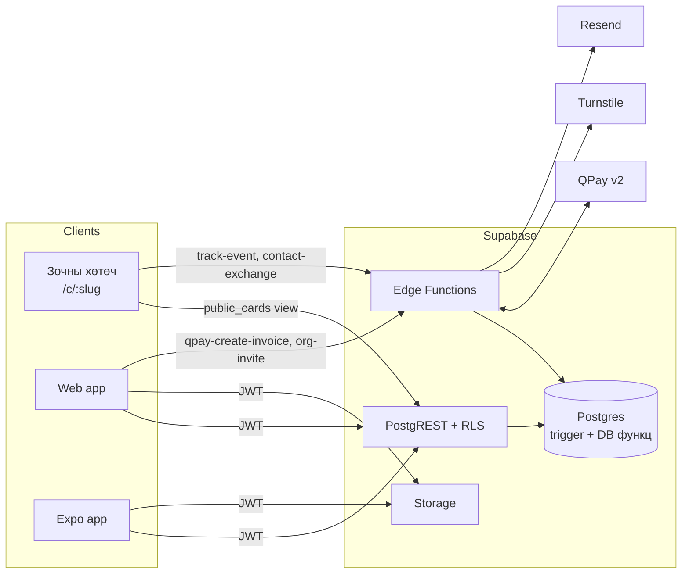
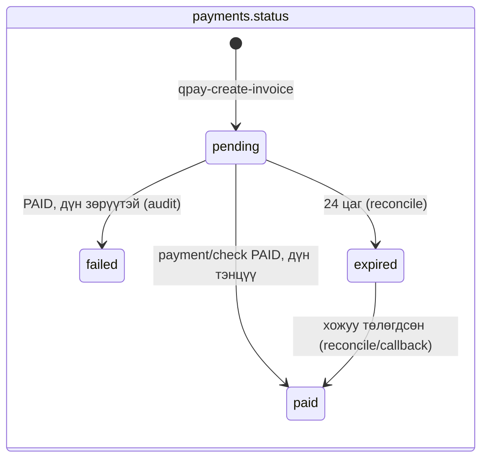
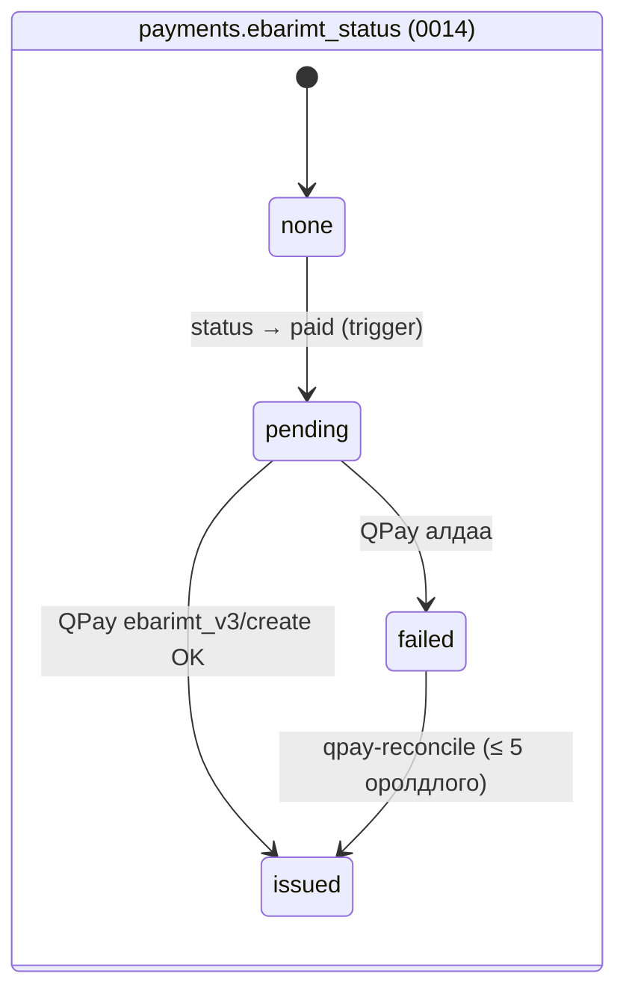
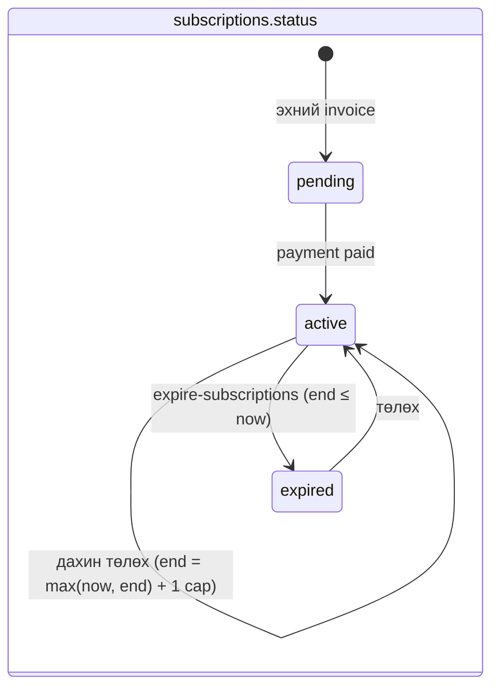
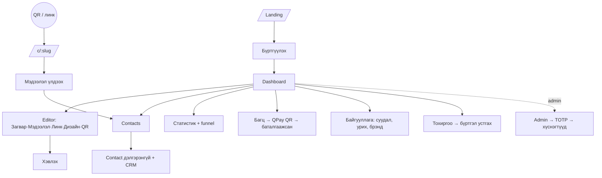

# Digital Card — Логик архитектур

Энэ баримт нь **одоогийн кодыг** тайлбарлана (backend/supabase/migrations, functions). Код өөрчлөгдвөл энд шинэчилнэ. Шийдвэрийн шалтгаан: [DECISIONS.md](DECISIONS.md).

**Зарчим:** эрх, квот, төлбөрийг зөвхөн Postgres (RLS + trigger + SECURITY DEFINER функц) шийднэ. Edge Function нь нууц түлхүүр шаардах ажлыг (QPay, Turnstile, IP-hash) хийгээд DB функц дуудна. Web/mobile нь UI-г нуудаг, `get_my_entitlements()`-ээр юу харуулахаа мэднэ.

## 1. Эрхийн загвар

### 1.1 Багц тодорхойлох
| Функц | Дүрэм |
|---|---|
| `active_plans(uid)` | `status='active' AND current_period_end > now()` хувийн subscription + active гишүүн байгууллагын subscription |
| `has_active_plan(uid)` | `active_plans` хоосон биш |
| `card_quota(uid)` | хувийн идэвхтэй багцын `card_limit`, үгүй бол `plans.free.card_limit` (1) |
| `crm_enabled(uid)` | идэвхтэй багцуудын аль нэг нь `crm_enabled` |
| `contact_limit(uid)` | идэвхтэй багцгүй → free (10); аль нэг нь `null` → хязгааргүй |
| `is_personal_plan_expired(uid)` | хувийн subscription нэг удаа идэвхжээд одоо идэвхгүй (UI-д мэдээлэл) |
| `is_platform_admin()` | `profiles.role='admin'` **ба** JWT `aal='aal2'` (TOTP) |

### 1.2 Эрхийн матриц (DB түвшинд)
| Үйлдэл | Free | Pro | Team ажилтан | Team admin | Багц дууссан |
|---|---|---|---|---|---|
| Карт үүсгэх | 1 хүртэл | 5 хүртэл | байгууллагад 1 | байгууллагад 1 | квот 1 (Free) |
| Карт засах | анхны 1 | анхны 5 | `allow_employee_edit_fields` | бүх ажилтны карт | анхны 1 |
| Байгууллагын загвар солих | — | — | ✗ | ✓ | — |
| Contact нэмэх | 10 хүртэл | ∞ | ∞ | ∞ | 10 хүртэл |
| CRM талбар (note, tags, status, follow_up_at, last_contacted_at, met_*) | ✗ | ✓ | ✓ | ✓ | ✗ |
| Статистик унших | өөрийн | өөрийн | өөрийн | бүх ажилтан | өөрийн |
| Нийтийн карт / QR / .vcf | ✓ | ✓ | ✓ | ✓ | ✓ |

«Анхны N» = эзэмшигчийн устгаагүй хувийн картуудыг `(created_at, id)`-ээр эрэмбэлэхэд `rank ≤ card_quota`.

### 1.3 Хаана шалгадаг вэ
| Хамгаалалт | Механизм |
|---|---|
| Хэн ямар мөр харах/бичих | RLS policy (бүх 12 хүснэгт), `0003_rls.sql` |
| Карт квот, байгууллагын карт, түгжсэн загвар | `cards_before_insert` trigger |
| Ажилтны талбарын хязгаар, template lock, immutable талбар | `cards_before_update` trigger |
| Client DELETE → soft delete | `cards_before_delete` trigger |
| Contact limit, CRM талбар, `source='exchange'` хуурамчлах | `contacts_before_write` trigger |
| Төлсөн суудал | `org_members_before_insert` trigger |
| `role` өөрчлөх | `profiles_before_update` trigger |
| Төлбөр, event, exchange, digest | service_role-д л нээлттэй SECURITY DEFINER функц |

## 2. Төлөвийн машинууд

| Объект | Төлөв | Шилжилт |
|---|---|---|
| Карт | draft (`is_published=false`) ↔ published; → deleted (`deleted_at`) | Эзэмшигч/editor; устгалыг сэргээхгүй |
| Contact | new → follow_up → customer / partner → closed | Чөлөөт (CRM эрхтэй үед). `follow_up_at` ≤ өнөөдөр, `status≠closed` → dashboard/digest |
| Эвент | идэвхгүй → идэвхтэй (`start_event`, ≤ 72 цаг) → дууссан (`stop_event` эсвэл хугацаа) | Идэвхтэй үед шинэ contact бүр эвентээр тэмдэглэгдэнэ (0013) |
| Passkey | бүртгэлгүй → бүртгэсэн → устгасан | Supabase Auth (`/passkeys/*`); нэвтрэлт `signInWithPasskey` |
| Org member | invited → active | `accept_org_invite()` эсвэл бүртгүүлэхэд имэйлээр холбогдоно |

`apply_payment_check()` нь payment мөрийг `FOR UPDATE` түгжээд `paid` бол шууд `already_paid` буцаана → давхар callback/reconcile хугацааг хоёр дахин сунгахгүй.

## 3. Event ба статистик
| Event | Хэзээ | Хаанаас |
|---|---|---|
| `view` | /c/:slug нээгдэх | web, mobile (deep link) |
| `qr_open` | `?src=qr`-тэй нээгдэх, апп-аар скан хийх | web, mobile |
| `link_click` (+`link_kind`) | линк дарах | web |
| `contact_save` | .vcf татах, утсанд хадгалах | web, mobile |
| `exchange` | зочин мэдээлэл үлдээх | contact-exchange |

- `visitor_hash = sha256(ip | user_agent | HMAC(STATS_SALT_SECRET, UB-өдөр))`. IP DB-д, лог-д хэзээ ч ордоггүй.
- Rate limit: track-event 30/мин/зочин/карт; exchange 5/цаг/зочин.
- `get_card_stats(ids, from)`: бүх хэмжүүр нэг event-ийн олонлогоос → `total_opens = views + qr_opens`, Бүх хугацаа ≥ 30 ≥ 7 ≥ Өнөөдөр.
- Өдрийн хил: Asia/Ulaanbaatar (UTC+8).

## 4. API гэрээ

### 4.1 Edge Functions
| Функц | Auth | Request | Response |
|---|---|---|---|
| `POST /qpay-create-invoice` | user JWT | `{ plan_id: 'pro'\|'team', org_id?, seats? }` | `{ payment_id, sender_invoice_no, amount_mnt, qr_image, qr_text, short_url, urls[] }` · 400 `invalid_plan` · 403 `not_org_admin` · 502 `qpay_unavailable` |
| `GET\|POST /qpay-callback?inv=` | — | (агуулгыг үл тооно) | 200 `{ status: paid\|already_paid\|not_paid\|amount_mismatch\|ignored\|retry_later }`; `paid` бол e-barimt шууд олгоно |
| `POST /wallet-pass` | user JWT | `{ card_id, kind: 'apple'\|'google' }` (өөрийн, нийтлэгдсэн карт) | apple: `application/vnd.apple.pkpass` · google: `{ url }` · 400 `invalid_request` · 404 `not_found` · 409 `card_not_published` · 429 · 501 `wallet_not_configured` |
| `POST /ai-assist` | user JWT | `{ task: bio\|scan\|note\|followup, locale, input }` | `{ result }` · 402/429 квот · 403 `crm_not_enabled` |
| `POST /track-event` | — (user JWT заавал биш) | `{ slug, event, link_kind? }` | 200 `ok` · 202 `rate_limited` · 404 `not_found` |
| `POST /contact-exchange` | — | `{ slug, name, phone?, email?, company?, title?, message?, consent, turnstile_token }` | 200 `{ status:'ok', owner_first_name }` · 400 `consent_required\|captcha_failed\|invalid` · 404 · 409 `owner_limit_reached` · 429 `rate_limited` |
| `POST /org-invite` | org admin JWT | `{ org_id, email, role? }` | `{ member_id }` · 403 `seat_limit_reached\|not_org_admin` · 400 `already_member\|invalid_email` |
| `POST /qpay-reconcile`, `/expire-subscriptions`, `/followup-digest` | `x-cron-secret` | — | тоон тайлан (`qpay-reconcile`: `receipts` = дахин олгосон e-barimt) |

### 4.2 RPC (PostgREST, user JWT)
`get_my_entitlements()`, `get_my_event()`, `start_event(name, hours)`, `stop_event()`, `nearby_bump(card_id, geohash)`, `get_card_stats(ids, from)`, `get_link_stats(ids, from)`, `get_named_viewers(card_id, from)`, `get_org_members(org_id)`, `accept_org_invite(org_id)`, `delete_my_account()`, `admin_list_users(search)` (aal2), `has_active_plan`, `card_quota`, `can_edit_card`.

### 4.3 Алдааны кодууд
DB нь `SQLSTATE 42501` (→ HTTP 403) эсвэл `P0001` (→ 400) + тогтмол MESSAGE буцаана. `packages/shared/errors.ts` → `errors.<key>` (MN/EN).

| Key | Утга |
|---|---|
| `card_quota_exceeded` | Картын тоо багцын хязгаарт хүрсэн |
| `contact_limit_reached` / `owner_limit_reached` | Contact хязгаар (эзэмшигч / зочинд) |
| `crm_not_enabled` | CRM талбар Free-д хаалттай |
| `seat_limit_reached` | Төлсөн суудал дүүрсэн |
| `org_template_locked`, `org_field_locked` | Байгууллага түгжсэн |
| `card_field_immutable`, `card_deleted`, `role_change_forbidden` | Өөрчлөх боломжгүй талбар |
| `exchange_source_forbidden`, `contact_owner_mismatch`, `card_owner_mismatch` | Хуурамчлах оролдлого |
| `not_org_admin`, `not_org_member`, `already_member`, `invite_not_found` | Байгууллага |
| `admin_mfa_required` | Админд aal2 хэрэгтэй |
| `consent_required`, `captcha_failed`, `rate_limited` | Exchange |

## 5. Cron
| Job | Хуваарь (UTC) | Үйлдэл |
|---|---|---|
| `qpay-reconcile` | */5 мин | < 24 цагийн pending-ийг payment/check; хуучныг expired; дутуу e-barimt-ийг дахин олгох (≤ 5 оролдлого) |
| `expire-subscriptions` | 16:05 (UB 00:05) | хугацаа дууссаныг expired; 3 хоногийн өмнөх сануулга |
| `followup-digest` | 01:00 (UB 09:00) | CRM хэрэглэгч бүрт өдөрт ≤ 1 имэйл (`email_queue.dedupe_key`) |

## 6. Дэлгэцийн урсгал

Mobile: `Нэвтрэх → Tabs(Миний карт · Скан · Харилцагчид · Статистик · Тохиргоо)`; Скан → `/c/[slug]` (Утсанд хадгалах, Миний contact-д нэмэх); Миний карт → `/edit/[id]`.
