# Digital Card — Төслийн танилцуулга

> **Уулзсан хүн бүрээ марталгүй.**
> Үнэгүй дижитал нэрийн хуудас + уулзалтын санах ой (contact, контекст, follow-up)

| | |
| --- | --- |
| Хувилбар | 1.0 — 2026.10.04 |
| Төлөв | Төлөвлөлт / Phase 0 (validation). Код: Prompt 00–04 хэрэгжсэн — [README](../README.md), [QA тайлан](../qa/TEST_REPORT.md) |
| Ажлын нэр | Digital Card (брэнд нэр эцэслэгдээгүй; LinkID зэрэг хувилбарыг барааны тэмдэг, домэйн шалгасны дараа сонгоно) |
| Платформ | Web (React) + Supabase + QPay → дараа нь Android, iOS (Expo) |
| Холбоотой баримт | «Digital Card — Төслийн баримт бичиг» (doc), «3 төслийн prompt» (doc), «Төлөвлөгөө ба танилцуулга» (slides) |

---

## Агуулга

1. [Товч танилцуулга](#1-товч-танилцуулга)
2. [Асуудал](#2-асуудал)
3. [Шийдэл ба гол урсгал](#3-шийдэл-ба-гол-урсгал)
4. [Зах зээл ба өрсөлдөгчид](#4-зах-зээл-ба-өрсөлдөгчид)
5. [Бүтээгдэхүүн (MVP ба цаашид)](#5-бүтээгдэхүүн-mvp-ба-цаашид)
6. [Бизнес загвар ба үнэ](#6-бизнес-загвар-ба-үнэ)
7. [Системийн архитектур](#7-системийн-архитектур)
8. [Өгөгдлийн сан](#8-өгөгдлийн-сан)
9. [Аюулгүй байдал ба хувийн мэдээлэл](#9-аюулгүй-байдал-ба-хувийн-мэдээлэл)
10. [Хөгжүүлэлтийн арга: Claude Code + QA gate](#10-хөгжүүлэлтийн-арга-claude-code--qa-gate)
11. [Хэрэгжүүлэх төлөвлөгөө](#11-хэрэгжүүлэх-төлөвлөгөө)
12. [Баг](#12-баг)
13. [Компани байгуулах](#13-компани-байгуулах)
14. [Төсөв ба зардал](#14-төсөв-ба-зардал)
15. [Эрсдэлийн бүртгэл](#15-эрсдэлийн-бүртгэл)
16. [Хэмжүүр (KPI)](#16-хэмжүүр-kpi)
17. [Хуулийн баримтууд](#17-хуулийн-баримтууд)
18. [Дараагийн алхам](#18-дараагийн-алхам)
19. [Хавсралт](#19-хавсралт)

---

## 1. Товч танилцуулга

Монголд дижитал нэрийн хуудас аль хэдийн үнэгүй буюу жилд 19,900₮-өөр зарагдаж байна. Тиймээс Digital Card картыг **үнэгүй** өгч, мөнгийг **картаас хойших үнэ цэнээс** авна: хэнтэй, хаана, хэзээ уулзсан, юу ярьсан, хэзээ дахин холбогдох вэ.

| Асуулт | Хариулт |
| --- | --- |
| Юу вэ? | Үнэгүй дижитал карт + төлбөртэй уулзалтын санах ой ба follow-up |
| Хэнд? | Борлуулагч, зөвлөх, даатгал, үл хөдлөх, чөлөөт ажилтан; дараа нь sales багтай байгууллага |
| Яагаад одоо? | Карт commodity болсон, харин уулзалтын дараах харилцааг удирдах Монгол хэрэгсэл алга |
| Хэрхэн мөнгө олох? | Freemium: Free → Pro (хувь хүн) → Team (байгууллага), QPay-ээр |
| Ялгарал | Contact exchange (зочинд апп хэрэггүй), уулзалтын контекст, follow-up сануулга, багийн lead самбар |

**Нэг өгүүлбэрээр:** «Хэнийг таньдаг вэ» гэдгийг хадгалж, «хэнтэй хэзээ, хаана, юу ярьсан бэ» гэдгийг санаж, «дараа нь хэнтэй холбогдох вэ» гэдгийг сануулдаг мэргэжлийн networking хэрэгсэл.

---

## 2. Асуудал

| Асуудал | Үр дагавар |
| --- | --- |
| Цаасан карт | Хэвлэх, шинэчлэх зардалтай; хэн уншиж, хадгалсныг мэдэхгүй |
| Контекст алдагдана | Хэнтэй, хаана, юу ярьснаа хэдэн долоо хоногийн дараа мартана |
| Follow-up хийгдэхгүй | Сануулга, жагсаалт байхгүй тул боломжит харилцагч алга болно |
| Байгууллага харахгүй | Sales баг арга хэмжээ, уулзалтаас хэдэн lead авсныг мэдэхгүй |

> Эдгээр нь таамаг. Phase 0-ийн 15–20 ярилцлагаар баталгаажуулна.

---

## 3. Шийдэл ба гол урсгал

### 3.1 Гол урсгал (core loop)

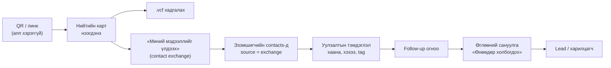

Contact exchange нь нэг талын картыг хоёр талын холбоо болгоно. Нөгөө хүн платформ дээр бүртгэлгүй байсан ч ажилладаг тул **cold start** асуудалгүй.

### 3.2 Хэрэглэгчийн аялал

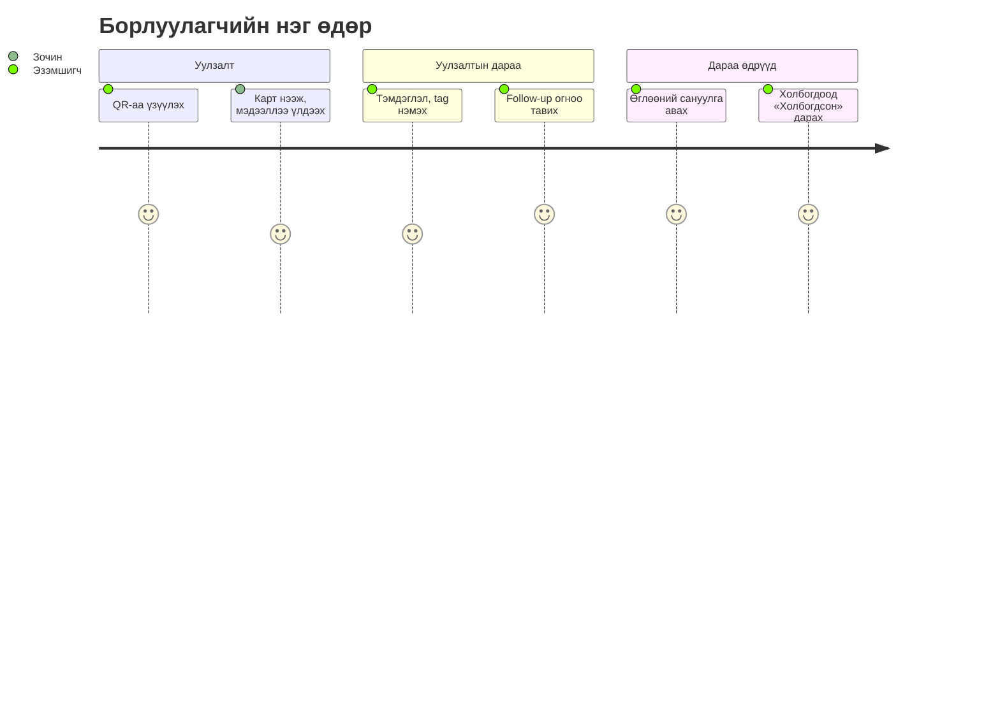

### 3.3 Байршуулалт

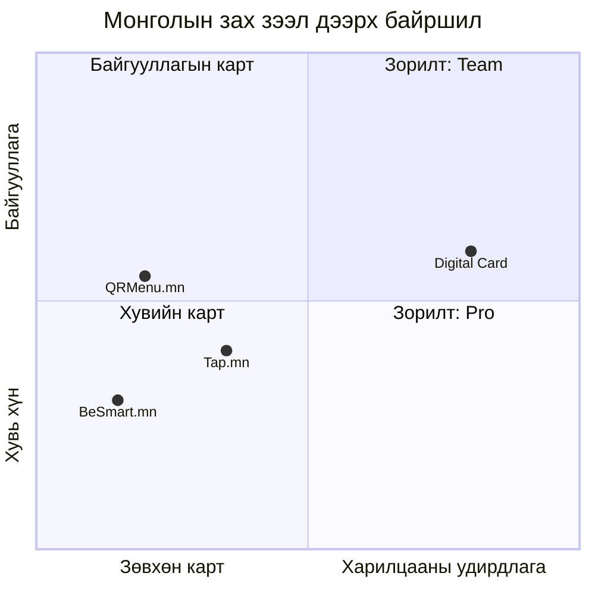

> Байршил нь чанарын үнэлгээ, тоон хэмжилт биш.

---

## 4. Зах зээл ба өрсөлдөгчид

### 4.1 Дотоодын өрсөлдөгчид (2026.10.04-нд сайтаас шалгасан)

| Өрсөлдөгч | Гол бүтээгдэхүүн | Үнэ | Бидэнд нөлөө |
| --- | --- | --- | --- |
| [QRMenu.mn](https://qrmenu.mn/) | QR цэс + QR код + нэрийн хуудас | Үнэгүй (30 хоног), Хувь хүн 19,900₮/жил (1 карт), Нэрийн хуудас 59,000₮/жил (10 хүн), Про 199,000₮/жил, Бизнес 299,000₮/жил | Карт + QR скан + хадгалах (апп-аар) нь ялгарал биш болсон |
| [Tap.mn](https://tap.mn/) | Карт + Telegram дэлгүүр + цаг захиалга | Bronze үнэгүй, Silver 19,900₮/сар, Gold 39,900₮/сар (10 карт) | Сард ~20,000₮ төлөгч байна, гэхдээ илүү олон боломжтой |
| BeSmart.mn | Физик NFC карт + профайл | [шалгах] | NFC-ийг түншээр шийдэх |

### 4.2 Гадаад

HiHello, Blinq, Popl, Linq, Mobilo, V1CE зэрэг дижитал/NFC картын бүтээгдэхүүн, мөн AI networking, personal CRM чиглэлийн шинэ бүтээгдэхүүнүүд бий. Монгол хэл, QPay, орон нутгийн дэмжлэггүй. **AI өөрөө ялгарал биш** — ялгарал нь Монгол контекст + QPay + багийн самбар.

> Гадаад өрсөлдөгчдийн мэдээлэл ерөнхий мэдлэгт тулгуурласан, тусгайлан шалгаагүй.

### 4.3 Боломжийн харьцуулалт

| Боломж | QRMenu.mn | Tap.mn | Digital Card |
| --- | --- | --- | --- |
| Дижитал карт, QR, vCard | ✓ | ✓ | ✓ (үнэгүй) |
| Бусдын картыг хадгалах | ✓ (апп) | — | ✓ |
| Зочин мэдээллээ үлдээх | — | Contact form | ✓ (contacts-д шууд) |
| Уулзалтын контекст, tag | — | — | ✓ |
| Follow-up сануулга | — | — | ✓ |
| Багийн lead / follow-up самбар | — | — | ✓ (Team) |

> Өрсөлдөгчдийн сайт дээр харагдсан боломжоор; бүрэн туршиж шалгаагүй.

---

## 5. Бүтээгдэхүүн (MVP ба цаашид)

### 5.1 MVP — зөвхөн веб, 4 гол боломж

| Боломж | Тайлбар |
| --- | --- |
| Contact exchange | Нийтийн карт дээр «Миний мэдээллийг үлдээх» маягт (нэр, утас/имэйл, байгууллага, зөвшөөрөл, captcha) |
| Уулзалтын санах ой | Огноо, газар (Арга хэмжээ / Оффис / Онлайн / Бусад), тэмдэглэл, tag, төлөв |
| Follow-up самбар | «Өнөөдөр холбогдох / Хоцорсон» жагсаалт, өдөрт 1 имэйл сануулга |
| Funnel статистик | Нээлт → .vcf хадгалсан → мэдээлэл үлдээсэн → follow-up хийсэн |

Суурь: бүртгэл, 10 загвар × 2 өнгө, live preview editor, QR, линк, .vcf, хэвлэх PDF (90×55 мм, 3 мм bleed), QPay төлбөр, админ, MN/EN хэл.

### 5.2 Модулиуд ба хувилбар

| Модуль | MVP (Web) | V2 | V3+ |
| --- | --- | --- | --- |
| Бүртгэл | Имэйл + нууц үг, сэргээх, устгах | Утасны OTP, Google/Apple | SSO |
| Карт | 10 загвар × 2 өнгө, линк, зураг, лого | Портфолио, үйлчилгээ | AI танилцуулга (MN/EN) |
| Хуваалцах | Линк, QR, Web Share, .vcf, хэвлэх PDF | NFC (түнштэй), Wallet pass | — |
| Contact exchange | Маягт → contacts | Хоёр талын Connect | Network graph |
| Contacts | CRUD, контекст, tag, төлөв, экспорт | Цаасан карт уншуулах (OCR) | CRM интеграц, API |
| Follow-up | Огноо, самбар, имэйл сануулга | Push, AI мессеж (MN/EN) | AI lead оноо |
| Статистик | Funnel, 7/30 хоног | Линкийн conversion | Багийн харьцуулалт |
| Team | Урих, түгжсэн загвар, брэнд, багийн funnel | Lead шилжүүлэх | Event mode |
| Апп | Веб PWA | Android, iOS | — |

### 5.3 Ирээдүйн санаанууд (хэрэглээ батлагдсаны дараа)

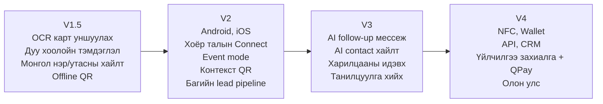

Зарчим: **AI мессежийг хэрэглэгч заавал баталж байж илгээнэ** (Edit / Send). Харилцааны «оноо» нь тайлбартай байна (хэдэн удаа, хэзээ холбогдсон), хүнийг шууд дүгнэхгүй.

---

## 6. Бизнес загвар ба үнэ

### 6.1 Багцууд (хувилбар A — таамаг)

| Эрх | Free | Pro | Team |
| --- | --- | --- | --- |
| Үнэ | 0₮ | 9,900₮/сар эсвэл 79,000₮/жил | 5,000₮/хүн/сар (5-аас доошгүй) |
| Карт | 1 | 5 | Ажилтан бүрт 1 |
| QR, линк, .vcf, хэвлэх PDF | ✓ | ✓ | ✓ |
| Contact exchange | 10 хүртэл | Хязгааргүй | Хязгааргүй |
| Тэмдэглэл, tag, контекст | — | ✓ | ✓ |
| Follow-up сануулга | — | ✓ | ✓ |
| Статистик | Нийт нээлт | Бүтэн funnel | Ажилтан өөрийнхөө, админ бүгдийг |
| Брэнд, түгжсэн загвар, багийн самбар | — | — | ✓ |

**Хувилбар B (өндөр үнэ):** Personal 29,000₮/сар, Pro 59,000₮/сар, Team 99,000₮/сар (5 хүн) + 15,000₮/нэмэлт хүн. Personal нь Tap Silver-ээс 1.5 дахин үнэтэй тул зөвхөн ярилцлагаар follow-up-ийн үнэ цэнэ батлагдвал сонгоно.

Үнийг `plans` хүснэгтээс уншдаг — сонголт кодод нөлөөлөхгүй.

### 6.2 Багц дууссан үед

Хэрэглэгч **Free руу буурна**: нэг карт, QR, .vcf ажилласаар; бусад карт нийтэд нээлттэй боловч засагдахгүй; contacts уншигдана, шинэ CRM бичилт, follow-up түгжигдэнэ. **Өгөгдөл устахгүй, тараасан QR үхэхгүй.**

### 6.3 Орлогын хувилбар (12 дахь сар, хувилбар A, таамаг)

| Хувилбар | Pro | Team (байгууллага × хүн) | Сарын орлого |
| --- | --- | --- | --- |
| Болгоомжтой | 150 | 10 × 10 | 1,985,000₮ |
| Дунд | 500 | 30 × 12 | 6,750,000₮ |
| Өөдрөг | 1,500 | 80 × 15 | 20,850,000₮ |

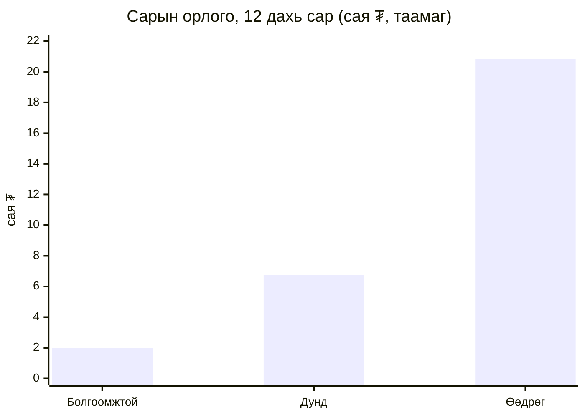

- Тогтмол дэд бүтцийн зардал сард ~150–250 мянган ₮ → 15–25 Pro хэрэглэгчээр хучигдана.
- Хамгийн том таамаг: Free → Pro шилжилт. Болгоомжтой хувилбарт ~3,000 идэвхтэй Free хэрэглэгч хэрэгтэй.

### 6.4 Нэмэлт орлого

Хэвлэсэн цаасан/NFC карт (түнштэй), байгууллагын брэнд дизайн, FB/IG пэйж ба постер үйлчилгээ, жилийн төлбөрийн хөнгөлөлт, Event pilot.

---

## 7. Системийн архитектур

### 7.1 Бүрэлдэхүүн

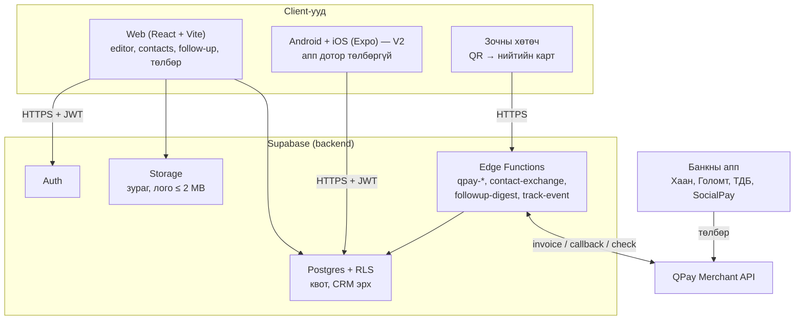

**Гол зарчим:** эрх, квот, төлбөрийг зөвхөн сервер (RLS + DB функц + Edge Function) шалгана. Web, mobile нь зөвхөн дэлгэц.

### 7.2 QPay төлбөрийн урсгал

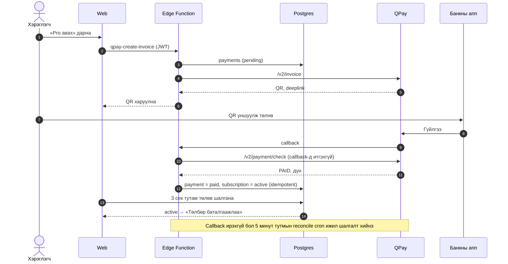

### 7.3 Contact exchange урсгал

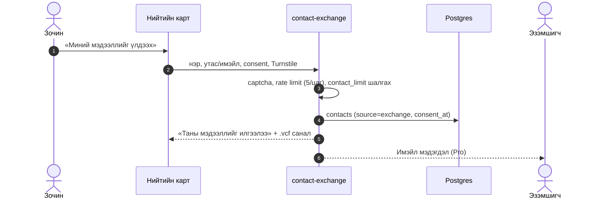

### 7.4 Технологи

| Хэсэг | Технологи | Байршил |
| --- | --- | --- |
| Web | React 18 + Vite + TypeScript, Tailwind, TanStack Query | Netlify / Vercel |
| Mobile (V2) | Expo (React Native), EAS build | App Store, Google Play |
| Backend | Supabase (Postgres, Auth, Storage, Edge Functions) | Supabase cloud |
| Нийтлэг код | packages/shared (types, zod, vCard, i18n) | Monorepo |
| Төлбөр | QPay v2 Merchant API | Sandbox → production |
| Spam хамгаалалт | Cloudflare Turnstile | — |
| Мониторинг | Sentry, uptime шалгагч | Cloud |

### 7.5 Хавтасны бүтэц

```text
Documents/DigitalCard/
├── backend/              # Prompt 00 — Supabase (migrations, functions, seed, tests)
├── packages/shared/      # types, plans, zod, vCard, i18n (MN/EN)
├── web/                  # Prompt 01 — React + Vite
├── mobile/               # Prompt 02, 03 — Expo
│   ├── android/          # expo prebuild
│   └── ios/              # expo prebuild
├── qa/                   # Prompt 04 — Playwright, Vitest, k6, Maestro
├── docs/                 # PRD, DECISIONS.md, store/, legal/
├── CLAUDE.md
└── README.md
```

---

## 8. Өгөгдлийн сан

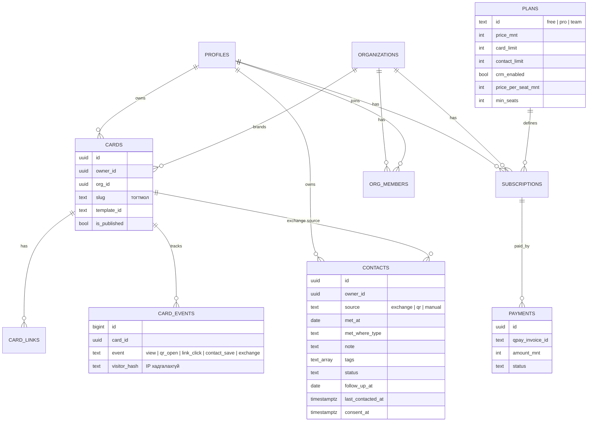

Бусад хүснэгт: `profiles`, `organizations`, `org_members`, `subscriptions`, `card_links`, `card_daily_stats`, `audit_log`.

---

## 9. Аюулгүй байдал ба хувийн мэдээлэл

| Хяналт | Хэрэгжүүлэлт |
| --- | --- |
| Хандалт | Бүх хүснэгтэд RLS; хэрэглэгч зөвхөн өөрийн мөр; Team admin зөвхөн өөрийн байгууллага |
| Квот, CRM эрх | DB trigger (UI-г тойрч REST дуудсан ч татгалзана) |
| Төлбөр | QPay callback-д итгэхгүй; payment/check, дүн тулгах, idempotent |
| Нууц түлхүүр | QPay, service role зөвхөн Edge Function secret-д |
| Exchange | Turnstile, rate limit, зөвшөөрлийн checkbox, блоклох |
| Админ | MFA (TOTP), audit log |
| Оролт | zod, XSS escape, линк зөвхөн https/mailto/tel |
| Дамжуулалт | HTTPS, HSTS, CSP, X-Frame-Options DENY |
| Нөөц | Өдөр бүр + point-in-time; улирал бүр сэргээх туршилт |

**Хувийн мэдээлэл (Хүний хувийн мэдээлэл хамгаалах тухай хууль):**

| Өгөгдөл | Цуглуулах эсэх | Хадгалах хугацаа |
| --- | --- | --- |
| Хэрэглэгчийн нэр, имэйл, утас | Тийм | Бүртгэл устгах хүртэл |
| Зочны IP хаяг | **Үгүй** | — |
| Зочны hash (давхардаагүй зочин) | Тийм | 13 сар |
| Зочны үлдээсэн мэдээлэл | Зөвхөн зөвшөөрлөөр | Эзэмшигч эсвэл зочин устгах хүртэл |
| Төлбөр | Invoice, гүйлгээний дугаар (картын дугаар биш) | Татварын хуулийн хугацаа |

**Mobile апп дотор төлбөр байхгүй:** App Store (3.1.1), Google Play-ийн дүрмээр апп доторх digital subscription-ийг зөвхөн тэдний billing-ээр авна. Тиймээс төлбөр зөвхөн веб дээр, апп-д үнэ, «Төлөх» товч, линк огт байхгүй.

> Нээлттэй асуулт: Supabase-ийн серверийн бүс (гадаад) — хуульчаас тодруулах.

---

## 10. Хөгжүүлэлтийн арга: Claude Code + QA gate

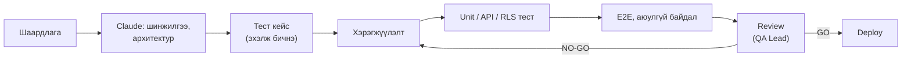

| Claude Code-ийн эрсдэл | Хариу арга |
| --- | --- |
| Буруу шаардлагыг хурдан хэрэгжүүлнэ | Prompt бүр «Хүлээн авах шалгуур»-тай; архитектор нь хүн |
| Архитектурын шилжилт (drift) | DATABASE.md, DECISIONS.md; schema зөвхөн migration-аар |
| Хуурамч хэрэгжүүлэлт (TODO, mock) | MOCK / STUB / DEMO / PRODUCTION төлвийг тодорхой ялгах; Critical тест |
| Хэт төвөгтэй болгох | React + Supabase + Edge Functions; microservice, Kafka хэрэггүй |
| Аюулгүй байдал | RLS тест 2 хэрэглэгчийн JWT-ээр, CI-д PR бүрт |

**Prompt-ууд** («3 төслийн prompt» doc): 00 Backend → 01 Web → 04 QA → (beta-ийн дараа) 02 Android → 03 iOS.

---

## 11. Хэрэгжүүлэх төлөвлөгөө

### 11.1 Үе шат ба гарцын шалгуур

| Үе шат | Агуулга | Prompt | Гарцын шалгуур |
| --- | --- | --- | --- |
| 0. Validation | 15–20 ярилцлага, landing + хүлээлгийн жагсаалт, үнийн A/B | — | 20-оос ≥ 8 төлнө гэсэн; жагсаалт ≥ 50 |
| 1. Backend | Schema, RLS, exchange, follow-up, Edge Functions | 00 | pgTAP бүгд PASS |
| 2. Web | Карт, exchange, CRM, follow-up, funnel, QPay sandbox | 01 | Бүтэн урсгал ажиллана |
| 3. QA | E2E, RLS, spam, аюулгүй байдал | 04 | Critical бүгд PASS |
| 4. Beta (веб) | 20–50 хэрэглэгч, 4 долоо хоног | — | ≥ 70% карт нийтэлсэн; ≥ 40% exchange авсан; ≥ 30% follow-up ашигласан |
| 5. Production (веб) | QPay production | — | GO checklist; эхний 20 төлбөртэй |
| 6. Mobile | Android, iOS | 02, 03 | 2-р сарын хадгалалт > 50% |
| 7. Team, Event pilot | 2–3 байгууллага, 1 арга хэмжээ | — | 1 байгууллага төлсөн |

### 11.2 Хугацааны төлөвлөгөө (таамаг)

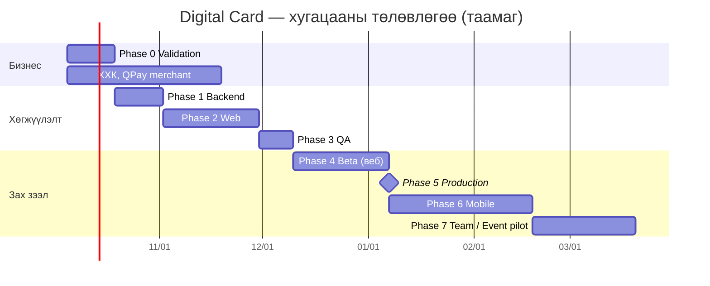

> Хугацаа нь нэг хүн, хагас цагаар ажиллана гэсэн таамаг. Phase 0-ийн үр дүнгээр шинэчилнэ.

### 11.3 Production GO checklist

- [ ] ХХК, татвар, банкны данс бүртгэгдсэн
- [ ] QPay production түлхүүр, e-barimt ажилласан (жинхэнэ жижиг гүйлгээгээр туршсан)
- [ ] Домэйн, SSL, имэйл (noreply@, support@)
- [ ] Supabase Pro, өдрийн нөөц, сэргээх туршилт
- [ ] Админ MFA
- [ ] Sentry, uptime мониторинг
- [ ] Хуулийн баримтууд хуульчаар хянагдаж нийтлэгдсэн
- [ ] Demo нэвтрэх мэдээлэл, туршилтын товч production-д байхгүй
- [ ] Prompt 04-ийн Critical тест бүгд PASS
- [ ] Дэмжлэгийн суваг (имэйл, Facebook пэйж)
- [ ] GO/NO-GO шийдвэрт гарын үсэг зурсан

---

## 12. Баг

### 12.1 Үүрэг хуваарилалт

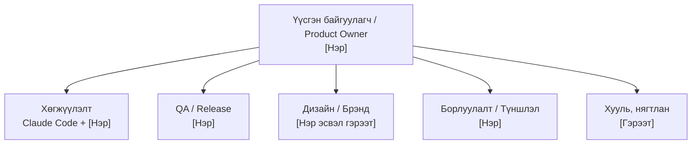

| Үүрэг | Хариуцах зүйл | Хүн | Цаг | Төлөв |
| --- | --- | --- | --- | --- |
| Product Owner / үүсгэн байгуулагч | Бүтээгдэхүүний шийдвэр, Phase 0 ярилцлага, prompt, roadmap | [Нэр] | [__ цаг/долоо хоног] | Бий |
| Хөгжүүлэлт | Claude Code-оор кодлох, code review, deploy | [Нэр] | [__] | [Бий / Хайх] |
| QA / Release | Тест төлөвлөгөө, RLS, E2E, GO/NO-GO | [Нэр] | [__] | [Бий / Хайх] |
| Дизайн / Брэнд | Лого, брэнд нэр, 10 загвар, landing | [Нэр / гэрээт] | [__] | Хайх |
| Борлуулалт / Түншлэл | Team борлуулалт, хэвлэх газар, NFC түнш, арга хэмжээ | [Нэр] | [__] | Хайх |
| Хууль, нягтлан | ХХК, гэрээ, нууцлал, татвар, e-barimt | [Гэрээт] | Шаардлагаар | Хайх |

### 12.2 RACI (гол шийдвэрүүд)

| Шийдвэр | Product Owner | Хөгжүүлэлт | QA | Хууль |
| --- | --- | --- | --- | --- |
| MVP-ийн хүрээ | A/R | C | C | — |
| Үнэ (A эсвэл B) | A/R | I | I | — |
| Schema, архитектур | A | R | C | — |
| Production GO/NO-GO | A | C | R | I |
| Хуулийн баримт нийтлэх | A | I | I | R |

R — гүйцэтгэнэ, A — эцсийн хариуцлага, C — зөвлөнө, I — мэдээлэл авна.

### 12.3 Bus factor

Нэг хүнээс хамаарах эрсдэлийг бууруулах: README, DECISIONS.md, CI, нууц түлхүүрүүдийг хамтарсан vault-д, Supabase/QPay/домэйн бүртгэлийг компанийн имэйлээр.

---

## 13. Компани байгуулах

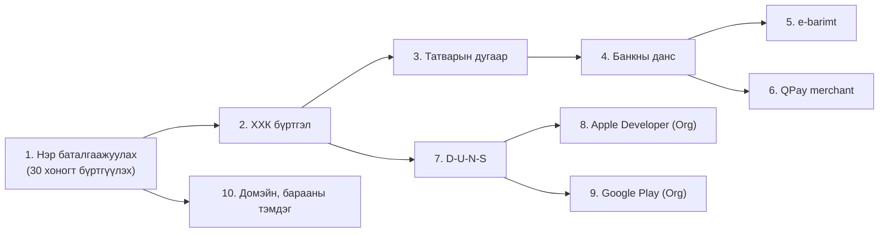

| # | Алхам | Хаана | Хэрэгтэй зүйл | Анхаарах |
| --- | --- | --- | --- | --- |
| 1 | Нэр баталгаажуулах | Улсын бүртгэлийн ерөнхий газар (e-Mongolia) | 2–3 нэрийн хувилбар | Нэр авснаас хойш 30 хоногт бүртгүүлэх |
| 2 | ХХК бүртгүүлэх | Улсын бүртгэлийн ерөнхий газар | Үүсгэн байгуулах шийдвэр, дүрэм, иргэний үнэмлэх, хаягийн баримт, хураамж | Үйл ажиллагааны чиглэл: программ хангамж, МТ үйлчилгээ |
| 3 | Татварын бүртгэл | Татварын ерөнхий газар | Гэрчилгээ | НӨАТ-ын босгыг нягтлантай тодруулах |
| 4 | Банкны данс | Хаан, Голомт гэх мэт | Гэрчилгээ, дүрэм, захирлын томилгоо | QPay-д холбогдоно |
| 5 | e-barimt | ebarimt.mn | Татварын дугаар | Хувь хүнд борлуулахад баримт олгох |
| 6 | QPay merchant | QPay | Гэрчилгээ, данс, вебсайт, үйлчилгээний нөхцөл | Шимтгэл, e-barimt холболтыг асуух |
| 7 | D-U-N-S | Dun & Bradstreet | Компанийн англи нэр, хаяг | Хэдэн долоо хоног болж магадгүй |
| 8 | Apple Developer (Org) | developer.apple.com | D-U-N-S, вебсайт | 99$/жил |
| 9 | Google Play (Org) | play.google.com/console | D-U-N-S | 25$ нэг удаа |
| 10 | Домэйн, барааны тэмдэг | .mn бүртгэгч, Оюуны өмчийн газар | Брэнд нэр | Нэр сонгосны дараа |

> Маягт, хураамж, хугацааг тухайн байгууллагаас баталгаажуулна.

**Компанийн мэдээлэл (бөглөх):**

| Талбар | Утга |
| --- | --- |
| Компанийн нэр | [ ] ХХК |
| Брэнд | [Digital Card / LinkID / бусад] |
| Регистрийн дугаар | [ ] |
| Хаяг | [ ] |
| Захирал | [ ] |
| Хувь нийлүүлэгчид, хувь | [ ] |
| Дүрмийн сан | [₮__] |
| Домэйн | [ ] |
| Холбоо барих | [support@ ], [утас] |

---

## 14. Төсөв ба зардал

### 14.1 Тогтмол зардал

| Зүйл | Дүн | Давтамж |
| --- | --- | --- |
| Supabase Pro | 25$ | Сар |
| Web hosting | 0–20$ | Сар |
| Имэйл илгээх үйлчилгээ | 0–20$ | Сар |
| Apple Developer | 99$ | Жил |
| Google Play Developer | 25$ | Нэг удаа |
| Домэйн (.mn) | [₮__] | Жил |
| QPay шимтгэл | Гэрээгээр | Гүйлгээ бүр |
| Нягтлан | [₮__] | Сар |

> Долларын дүн нь үйлчилгээ үзүүлэгчдийн олон нийтэд зарласан үнэ; захиалахын өмнө шалгана.

### 14.2 Эхлэлийн төсөв (бөглөх)

| Ангилал | Дүн | Тайлбар |
| --- | --- | --- |
| ХХК бүртгэл, хураамж | [₮__] | |
| Хуулийн хяналт (нөхцөл, нууцлал, гэрээ) | [₮__] | Нэг удаа |
| Брэнд, лого, дизайн | [₮__] | |
| Дэд бүтэц (эхний 6 сар) | [₮__] | 14.1-ээс |
| Phase 0 ярилцлага, beta урамшуулал | [₮__] | |
| Маркетинг (beta, launch) | [₮__] | |
| NFC/хэвлэлийн дээж | [₮__] | Сонголттой |
| **Нийт** | **[₮__]** | |

---

## 15. Эрсдэлийн бүртгэл

| ID | Эрсдэл | Түвшин | Хариу арга | Тест |
| --- | --- | --- | --- | --- |
| R20 | Хэрэглэгч follow-up-д төлөхгүй | Critical | Phase 0 ярилцлага, beta хэмжүүр; биелэхгүй бол кодлохоо зогсооно | — |
| R05 | App Store / Play татгалзах | Critical | Апп-д үнэ, төлбөр, линк байхгүй | STORE-01 |
| R01 | Хуурамч төлбөрөөр эрх авах | Critical | payment/check, дүн тулгах | PAY-01, PAY-04 |
| R02 | Бусдын өгөгдөлд хандах | Critical | RLS, 2 хэрэглэгчийн тест | SEC-01 |
| R10 | Team ажилтан бусдын статистик харах | Critical | is_org_admin | ORG-01 |
| R14 | Админ бүртгэл хакдах | Critical | MFA, audit log | — |
| R15 | Өгөгдөл алдах | Critical | Нөөц, сэргээх туршилт | — |
| R21 | Exchange-ээр spam, бусдын нэрээр | High | Turnstile, rate limit, зөвшөөрөл | EXC-01, EXC-02 |
| R22 | Хамрах хүрээ тэлэх | High | V2+ санааг MVP-д оруулахгүй | — |
| R06 | QPay merchant удаах | High | ХХК-ийг Phase 0-той зэрэг | — |
| R07 | Callback ирэхгүй | High | Reconcile cron | PAY-03 |
| R08 | Хувийн мэдээллийн гомдол | High | Нэргүй тоо, opt-in, IP хадгалахгүй | PRIV-01, PRIV-02 |
| R09 | Тараасан QR ажиллахаа болих | High | Тогтмол slug, Free руу буурна | PUB-01 |
| R17 | e-barimt олгоогүй | High | QPay e-barimt, нягтлан | — |
| R18 | Хуулийн баримт хяналтгүй нийтлэгдэх | High | Хуульчийн гарын үсэг | — |
| R19 | Bus factor | Medium | README, DECISIONS.md, vault | — |

---

## 16. Хэмжүүр (KPI)

### 16.1 Бүтээгдэхүүний funnel

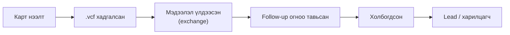

Гол хэмжүүр: **Exchange rate** (нээлт → мэдээлэл үлдээсэн) ба **Follow-up completion** (тавьсан follow-up → «Холбогдсон»). Profile view нь vanity metric.

### 16.2 Бизнесийн шат

| Шат | Зорилт |
| --- | --- |
| Бүртгэл | 100 хэрэглэгч |
| Идэвхжилт | 70 нийтэлсэн карт |
| Хэрэглээ | 50 долоо хоног бүр идэвхтэй |
| Төлбөр | 20 төлбөртэй |
| Хадгалалт | 2 дахь сарын хадгалалт > 50% |
| Өсөлт | 100 төлбөртэй |
| B2B | 10 байгууллага |

---

## 17. Хуулийн баримтууд

Төсөл нь «Төслийн баримт бичиг» doc-ын «Хуулийн баримтууд» табд байна. **Нийтлэхээс өмнө хуульчаар заавал хянуулна.**

| # | Баримт | Төлөв |
| --- | --- | --- |
| 1 | Үйлчилгээний нөхцөл | Төсөл |
| 2 | Нууцлалын бодлого (зочны үлдээсэн мэдээлэл орсон) | Төсөл |
| 3 | Subscription, цуцлалт, буцаалтын бодлого | Төсөл |
| 4 | Байгууллагын гэрээ ба мэдээлэл боловсруулах нөхцөл | Төсөл |
| 5 | Ашиглалтын дүрэм, бүртгэл устгах, хадгалах хугацаа | Төсөл |
| 6 | Cookie / статистикийн мэдэгдэл | Хийх |
| 7 | App Store / Google Play-ийн нууцлалын хариулт | Prompt 02, 03-т |

---

## 18. Дараагийн алхам

**Дараагийн 2 долоо хоног — Phase 0:**

- [ ] 15–20 ярилцлага: борлуулагч, даатгал, үл хөдлөх, HR
- [ ] Одоогийн demo дээр landing + хүлээлгийн жагсаалт
- [ ] Үнийн A/B асуулт
- [ ] ХХК-ийн нэр баталгаажуулах
- [ ] BeSmart.mn-ийн үнэ, боломжийг шалгах
- [ ] Брэнд нэрийн 3 хувилбар, домэйн, барааны тэмдэг шалгах

**Ярилцлагын 2 гол асуулт:**

1. Уулзсан хүмүүсээ одоо яаж санаж, follow-up хийдэг вэ?
2. Үүнийг автоматаар хийдэг хэрэгсэлд сард 9,900₮ төлөх үү?

**GO нөхцөл:** 20-оос ≥ 8 нь төлнө гэсэн, жагсаалтад ≥ 50 хүн → Claude Code-д Prompt 00-ийг өгнө.

---

## 19. Хавсралт

### 19.1 Нэр томъёо

| Нэр томъёо | Утга |
| --- | --- |
| Contact exchange | Зочин картын эзэнд өөрийн мэдээллийг зөвшөөрлөөр үлдээх |
| Follow-up | Уулзсаны дараа дахин холбогдох |
| Funnel | Нээлтээс lead хүртэлх шат дараалсан тоо |
| RLS | Row Level Security — мөр түвшний хандалтын хяналт |
| Edge Function | Supabase дээрх серверийн код (нууц түлхүүр энд) |
| Cold start | Хоёр талын платформд эхний хэрэглэгчид үнэ цэнэ олохгүй байх асуудал |
| PWA | Вебийг апп шиг суулгаж ашиглах |

### 19.2 Эх сурвалж

- QRMenu.mn үнэ, боломж — https://qrmenu.mn/ (2026.10.04)
- Tap.mn үнэ, боломж — https://tap.mn/ (2026.10.04)

### 19.3 Өөрчлөлтийн түүх

| Огноо | Өөрчлөлт |
| --- | --- |
| 2026.10.04 | Анхны хувилбар: Basic/Pro/Org → Free/Pro/Team, contact exchange, follow-up, web-first, Phase 0 |
